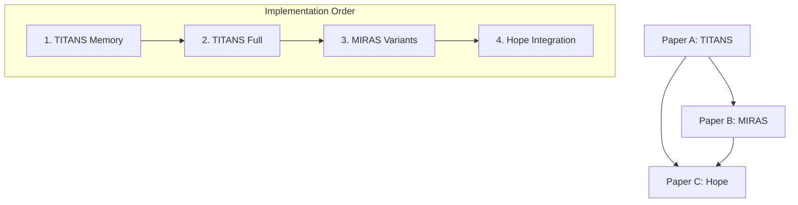

# Implementation Plan Template

The orchestrator creates this after reading all `.context.md` files. This is the execution roadmap.

## File Name

```
IMPLEMENTATION_PLAN.md
```

## Template

```markdown
# Implementation Plan: {Project Name}

**Generated:** {ISO timestamp}
**Papers:** {list of paper IDs}
**Intent:** {Validate | Full Reproduction | Specific Component | Extend}
**Target Environment:** {Local CPU | Local GPU | Colab Free | Colab Pro}

---

## Executive Summary

**What we're building:**
{1-2 sentence description}

**Paper dependency chain:**
```
{Paper A} ──► {Paper B} ──► {Paper C}
(Foundation)   (Extension)   (Application)
```

**Estimated effort:**
- Equations to implement: {N}
- Algorithms to implement: {N}
- Total test files: {N}
- Estimated time: {hours/days}

---

## 1. DEPENDENCY GRAPH

### Paper Dependencies



### Equation Dependencies

| Equation | Paper | Depends On | Used By |
|----------|-------|------------|---------|
| Eq 3 (Memory Update) | TITANS | None | Eq 5, Alg 1 |
| Eq 5 (Surprise) | TITANS | Eq 3 | Alg 2 |
| Eq 8 (YAAD) | MIRAS | TITANS Eq 3 | Alg 3 |
| Eq 12 (Hope) | Hope | MIRAS Eq 8 | Alg 5 |

### Module Dependencies

```
┌─────────────────────────────────────────────────────────────┐
│ Level 0: Foundation (No dependencies)                        │
│ ├── attention.py (standard scaled dot-product)              │
│ ├── embeddings.py (token + position)                        │
│ └── utils/config.py                                         │
├─────────────────────────────────────────────────────────────┤
│ Level 1: TITANS Core                                        │
│ ├── memory_update.py (Eq 3) ─── requires: nothing          │
│ ├── surprise_gate.py (Eq 5) ─── requires: memory_update    │
│ └── memory_layer.py (Alg 1) ─── requires: all above        │
├─────────────────────────────────────────────────────────────┤
│ Level 2: MIRAS Extensions                                   │
│ ├── yaad_layer.py (Eq 8) ───── requires: memory_layer      │
│ ├── moneta_layer.py (Eq 9) ─── requires: memory_layer      │
│ └── memora_layer.py (Eq 10) ── requires: memory_layer      │
├─────────────────────────────────────────────────────────────┤
│ Level 3: Hope Integration                                   │
│ ├── hope_architecture.py ──── requires: MIRAS layers       │
│ └── cms_module.py ─────────── requires: hope_architecture  │
└─────────────────────────────────────────────────────────────┘
```

---

## 2. IMPLEMENTATION PHASES

### Phase 1: Project Setup
**Duration:** 30 minutes

```bash
# Tasks
1. Initialize UV project
2. Add core dependencies  
3. Create directory structure
4. Set up test framework
5. Configure ruff and ty
```

**Commands:**
```bash
uv init {project-name}
cd {project-name}
uv add torch numpy einops
uv add --dev pytest pytest-cov ruff
mkdir -p src/{layers,utils} tests/{test_equations,test_layers,test_integration} configs notebooks docs
```

**Deliverables:**
- [ ] `pyproject.toml` configured
- [ ] Directory structure created
- [ ] `uv sync` succeeds
- [ ] `uv run pytest` runs (0 tests)

---

### Phase 2: Equation Tests (Test-First)
**Duration:** {N} hours

Write tests BEFORE implementation for each equation.

#### Phase 2.1: TITANS Equations

| Task | Equation | Test File | Priority |
|------|----------|-----------|----------|
| 2.1.1 | Eq 3: Memory Update | `tests/test_equations/test_eq3_memory_update.py` | P0 |
| 2.1.2 | Eq 5: Surprise Metric | `tests/test_equations/test_eq5_surprise.py` | P0 |
| 2.1.3 | Eq 7: Gated Update | `tests/test_equations/test_eq7_gated_update.py` | P1 |

**Test Template per Equation:**
```python
# tests/test_equations/test_eq{N}_{name}.py
"""
Equation {N}: {LaTeX}
Paper: {Paper Name}
Section: {X.Y}
"""

class TestEquation{N}:
    def test_output_shape(self): ...
    def test_gradient_flow(self): ...
    def test_numerical_stability(self): ...
    def test_deterministic(self): ...
    def test_edge_cases(self): ...
```

**Verification Criteria:**
- [ ] All tests written
- [ ] All tests initially fail (no implementation)
- [ ] Test coverage plan: {N} tests per equation

#### Phase 2.2: MIRAS Equations

| Task | Equation | Test File | Priority |
|------|----------|-----------|----------|
| 2.2.1 | Eq 8: YAAD | `tests/test_equations/test_eq8_yaad.py` | P0 |
| 2.2.2 | Eq 9: MONETA | `tests/test_equations/test_eq9_moneta.py` | P1 |
| 2.2.3 | Eq 10: MEMORA | `tests/test_equations/test_eq10_memora.py` | P1 |

#### Phase 2.3: Hope Equations
...

---

### Phase 3: Core Implementation
**Duration:** {N} hours

Implement modules to pass tests, following dependency order.

#### Phase 3.1: Level 0 - Foundation

| Task | Module | Dependencies | Tests to Pass |
|------|--------|--------------|---------------|
| 3.1.1 | `src/layers/attention.py` | None | test_attention.py |
| 3.1.2 | `src/layers/embeddings.py` | None | test_embeddings.py |
| 3.1.3 | `src/utils/config.py` | None | test_config.py |

#### Phase 3.2: Level 1 - TITANS Core

| Task | Module | Dependencies | Tests to Pass |
|------|--------|--------------|---------------|
| 3.2.1 | `src/layers/memory_update.py` | None | test_eq3_*.py |
| 3.2.2 | `src/layers/surprise_gate.py` | memory_update | test_eq5_*.py |
| 3.2.3 | `src/layers/memory_layer.py` | All Level 1 | test_memory_layer.py |

**Checkpoint:** All TITANS tests pass
```bash
uv run pytest tests/test_equations/test_eq3*.py tests/test_equations/test_eq5*.py -v
```

#### Phase 3.3: Level 2 - MIRAS Extensions
...

#### Phase 3.4: Level 3 - Hope Integration
...

---

### Phase 4: Model Assembly
**Duration:** {N} hours

Combine all modules into complete models.

| Task | Model | Components | Test |
|------|-------|------------|------|
| 4.1 | TITANSModel | Level 0-1 modules | test_titans_model.py |
| 4.2 | MIRASModel | Level 0-2 modules | test_miras_model.py |
| 4.3 | HopeModel | All modules | test_hope_model.py |

**Model Tests:**
```python
# tests/test_integration/test_titans_model.py

def test_forward_pass():
    """Model completes forward pass without error."""

def test_backward_pass():
    """Gradients flow through entire model."""

def test_parameter_count():
    """Parameter count matches paper specification."""

def test_checkpoint_save_load():
    """Model state can be saved and restored."""
```

---

### Phase 5: Training Infrastructure
**Duration:** {N} hours

| Task | Component | Description |
|------|-----------|-------------|
| 5.1 | `src/train.py` | Training loop |
| 5.2 | `src/data.py` | Data loading |
| 5.3 | `configs/train.yaml` | Training config |
| 5.4 | `src/utils/logging.py` | Metrics logging |

**Training Loop Checklist:**
- [ ] Learning rate scheduling
- [ ] Gradient clipping
- [ ] Checkpointing
- [ ] Logging (wandb optional)
- [ ] Early stopping
- [ ] Mixed precision (optional)

---

### Phase 6: Code Quality
**Duration:** 1-2 hours

```bash
# Run all quality checks
uv run ruff format src/ tests/
uv run ruff check src/ tests/ --fix
uv run ty check src/
uv run pytest tests/ -v --cov=src --cov-report=term-missing
```

**Quality Gates:**
- [ ] `ruff format` - no changes needed
- [ ] `ruff check` - 0 errors
- [ ] `ty check` - 0 type errors
- [ ] `pytest` - 100% pass rate
- [ ] Coverage > 80%

---

### Phase 7: Documentation
**Duration:** 2-3 hours

| Task | Output | Template |
|------|--------|----------|
| 7.1 | `README.md` | Quick start, usage, results |
| 7.2 | `ARCHITECTURE.md` | Design decisions, diagrams |
| 7.3 | `docs/equations.md` | All equations with code links |
| 7.4 | `docs/benchmarks.md` | How to reproduce results |

---

### Phase 8: Git & Release Prep
**Duration:** 30 minutes

```bash
# Initialize repo
git init
git add .
git commit -m "Initial implementation: {Paper Names}

Implements:
- TITANS memory module (Eq 3, 5)
- MIRAS variants (Eq 8-10)
- Hope integration

Papers:
- {arXiv links}

Test coverage: {X}%"

# Prepare for GitHub
gh repo create {repo-name} --public --source=. --remote=origin --push
```

---

## 3. FILE MANIFEST

### Source Files

```
src/
├── __init__.py
├── model.py                    # Main model class
├── train.py                    # Training loop
├── inference.py                # Inference utilities
├── data.py                     # Data loading
│
├── layers/
│   ├── __init__.py
│   ├── attention.py            # Standard attention
│   ├── embeddings.py           # Token + position embeddings
│   ├── memory_update.py        # Eq 3 - core memory update
│   ├── surprise_gate.py        # Eq 5 - surprise metric
│   ├── memory_layer.py         # Alg 1 - full memory layer
│   ├── yaad_layer.py           # Eq 8 - MIRAS YAAD
│   ├── moneta_layer.py         # Eq 9 - MIRAS MONETA
│   ├── memora_layer.py         # Eq 10 - MIRAS MEMORA
│   └── hope_layer.py           # Hope integration
│
└── utils/
    ├── __init__.py
    ├── config.py               # Configuration handling
    └── logging.py              # Logging utilities
```

### Test Files

```
tests/
├── __init__.py
├── conftest.py                 # Shared fixtures
│
├── test_equations/
│   ├── __init__.py
│   ├── test_eq3_memory_update.py
│   ├── test_eq5_surprise.py
│   ├── test_eq7_gated_update.py
│   ├── test_eq8_yaad.py
│   ├── test_eq9_moneta.py
│   └── test_eq10_memora.py
│
├── test_layers/
│   ├── __init__.py
│   ├── test_attention.py
│   ├── test_memory_layer.py
│   └── test_model.py
│
└── test_integration/
    ├── __init__.py
    ├── test_forward_backward.py
    └── test_training_step.py
```

### Config Files

```
configs/
├── default.yaml                # Default configuration
├── small.yaml                  # Small model for testing
├── titans_base.yaml            # TITANS paper config
├── miras_yaad.yaml             # MIRAS YAAD variant
└── hope_full.yaml              # Hope full config
```

---

## 4. VERIFICATION CHECKPOINTS

### Checkpoint 1: Foundation Tests Pass
```bash
uv run pytest tests/test_layers/test_attention.py tests/test_layers/test_embeddings.py -v
# Expected: All pass
```

### Checkpoint 2: TITANS Complete
```bash
uv run pytest tests/test_equations/test_eq3*.py tests/test_equations/test_eq5*.py tests/test_layers/test_memory_layer.py -v
# Expected: All pass
```

### Checkpoint 3: Full Model Runs
```python
from src.model import TITANSModel
model = TITANSModel.from_config("configs/small.yaml")
x = torch.randint(0, 1000, (2, 128))
logits, memory = model(x)
assert logits.shape == (2, 128, model.vocab_size)
```

### Checkpoint 4: Training Runs
```bash
uv run python -m src.train --config configs/small.yaml --max_steps 100
# Expected: No errors, loss decreases
```

### Checkpoint 5: Quality Gates Pass
```bash
uv run ruff format --check src/ tests/
uv run ruff check src/ tests/
uv run ty check src/
uv run pytest tests/ --cov=src --cov-fail-under=80
# Expected: All pass
```

---

## 5. RISK MITIGATION

### Identified Risks

| Risk | Impact | Mitigation |
|------|--------|------------|
| Paper ambiguity in Eq X | High | Document interpretation, test edge cases |
| Memory scaling issues | Medium | Test with small memory first, gradient checkpointing |
| Training instability | Medium | Start with paper's exact hyperparameters |
| Benchmark data access | Low | Prepare download scripts early |

### Contingency Plans

**If equation interpretation unclear:**
1. Check paper's appendix
2. Check related papers for similar equations
3. Document our interpretation explicitly
4. Test multiple interpretations

**If training doesn't converge:**
1. Verify forward/backward correctness first
2. Check learning rate (try 10x smaller)
3. Check gradient norms
4. Compare intermediate values with paper (if available)

---

## 6. SUCCESS CRITERIA

### Minimum Viable Success
- [ ] All equations implemented with passing tests
- [ ] Model forward pass works
- [ ] Can run training for 1000 steps without crash
- [ ] Code passes all quality checks
- [ ] Documentation complete

### Full Success
- [ ] All above criteria
- [ ] Benchmark results within 10% of paper
- [ ] Training reproduces paper's learning curves
- [ ] Model checkpoints available

### Stretch Goals
- [ ] Benchmark results within 5% of paper
- [ ] Optimizations (fused kernels, etc.)
- [ ] Additional ablations

---

## METADATA

```yaml
plan_version: "1.0"
generated_at: "{ISO timestamp}"
papers_included:
  - id: "TITANS"
    context_file: "TITANS.context.md"
  - id: "MIRAS"
    context_file: "MIRAS.context.md"
  - id: "HOPE"
    context_file: "HOPE.context.md"
total_equations: {N}
total_algorithms: {N}
estimated_hours: {N}
```
```
